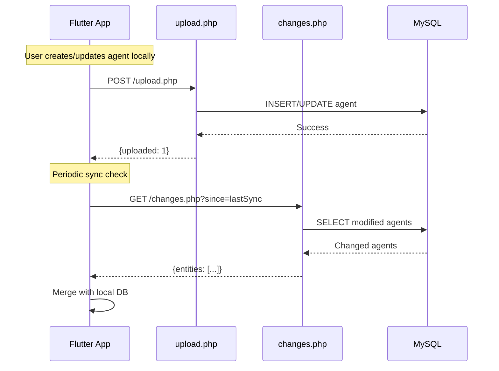

# 🌐 Agent Management API - Complete Documentation

**Version**: 1.0  
**Last Updated**: 2025-12-11  
**Base URL**: `/server/api/sync/agents/`

---

## 📋 Overview

The Agent Management API provides **bidirectional synchronization** for agent data between Flutter mobile app and MySQL server.

### Endpoints Available

1. **POST** `/upload.php` - Upload agents (CREATE/UPDATE)
2. **GET** `/changes.php` - Download agents (READ)

---

## 📤 1. UPLOAD AGENTS

### Endpoint
```
POST /server/api/sync/agents/upload.php
```

### Purpose
Upload local agent changes to server (INSERT new agents or UPDATE existing ones)

### Request Headers
```http
Content-Type: application/json
Accept: application/json
```

### Request Body
```json
{
  "entities": [
    {
      "id": 1702345678901,
      "username": "agent1",
      "password": "password123",
      "nom": "John Doe",
      "telephone": "+243999999999",
      "shop_id": 1,
      "shop_designation": "Shop Principal",
      "role": "AGENT",
      "is_active": 1,
      "created_at": "2025-01-01 10:00:00",
      "last_modified_at": "2025-12-11 10:00:00",
      "last_modified_by": "admin",
      "synced_at": "2025-12-11T10:00:00+00:00"
    }
  ],
  "user_id": "admin"
}
```

### Request Parameters

| Field | Type | Required | Description |
|-------|------|----------|-------------|
| `entities` | Array | ✅ Yes | Array of agent objects to sync |
| `user_id` | String | ⚠️ Optional | User performing the upload (default: "unknown") |

### Entity Object Fields

| Field | Type | Required | Description |
|-------|------|----------|-------------|
| `id` | Integer | ✅ Yes* | Agent ID (timestamp or auto-increment) |
| `username` | String | ✅ Yes | Unique username (3-100 chars) |
| `password` | String | ✅ Yes | Password (plain text - hash in production!) |
| `nom` | String | ⚠️ Optional | Full name |
| `telephone` | String | ⚠️ Optional | Phone number |
| `shop_id` | Integer | ✅ Yes | Shop ID (foreign key → shops.id) |
| `shop_designation` | String | ⚠️ Optional | Shop name (resolved to shop_id if provided) |
| `role` | String | ⚠️ Optional | 'AGENT' or 'ADMIN' (default: 'AGENT') |
| `is_active` | Boolean | ⚠️ Optional | Active status (default: 1) |
| `created_at` | DateTime | ⚠️ Optional | Creation timestamp |
| `last_modified_at` | DateTime | ⚠️ Optional | Last modification timestamp |
| `last_modified_by` | String | ⚠️ Optional | Who modified it |
| `synced_at` | DateTime | ⚠️ Optional | Sync timestamp (ISO 8601) |

\* *For INSERT, `id` can be null and server will auto-generate*

### Success Response (200 OK)
```json
{
  "success": true,
  "message": "Synchronisation réussie",
  "uploaded": 1,
  "updated": 0,
  "total": 1,
  "errors": [],
  "timestamp": "2025-12-11T10:00:00+00:00"
}
```

### Response Fields

| Field | Type | Description |
|-------|------|-------------|
| `success` | Boolean | Always `true` on 200 response |
| `message` | String | Human-readable message |
| `uploaded` | Integer | Number of new agents inserted |
| `updated` | Integer | Number of existing agents updated |
| `total` | Integer | Total agents processed |
| `errors` | Array | List of errors per entity (if any) |
| `timestamp` | String | Server timestamp (ISO 8601) |

### Error Response (500 Internal Server Error)
```json
{
  "success": false,
  "message": "Erreur serveur: [error details]",
  "timestamp": "2025-12-11T10:00:00+00:00"
}
```

### Partial Errors (200 OK with errors array)
```json
{
  "success": true,
  "message": "Synchronisation réussie",
  "uploaded": 1,
  "updated": 0,
  "total": 1,
  "errors": [
    {
      "entity_id": 123,
      "error": "Le shop référencé (shop_id=99) n'existe pas. Synchronisez d'abord les shops."
    }
  ],
  "timestamp": "2025-12-11T10:00:00+00:00"
}
```

### Business Logic

#### INSERT (New Agent)
1. Check if agent with `id` exists
2. If **NOT exists**:
   - Resolve `shop_id` from `shop_designation` (if provided)
   - Execute `INSERT IGNORE` (prevents duplicates on username)
   - Mark as `is_synced = 1`
   - Return `lastInsertId`

#### UPDATE (Existing Agent)
1. Check if agent with `id` exists
2. If **exists**:
   - Execute `UPDATE` on all fields
   - Preserve `created_at` (not updated)
   - Mark as `is_synced = 1`

#### Foreign Key Handling
- ✅ Validates `shop_id` exists in `shops` table
- ❌ Returns friendly error if shop doesn't exist
- 💡 Suggests: "Synchronisez d'abord les shops"

#### Transaction Safety
- ✅ All operations wrapped in transaction
- ✅ Rollback on any error
- ✅ Commit only if all succeed

---

## 📥 2. DOWNLOAD AGENTS (CHANGES)

### Endpoint
```
GET /server/api/sync/agents/changes.php
```

### Purpose
Download agent changes from server (incremental sync)

### Request Parameters (Query String)

| Parameter | Type | Required | Description |
|-----------|------|----------|-------------|
| `since` | DateTime | ⚠️ Optional | Last sync timestamp (ISO 8601) |
| `user_id` | String | ⚠️ Optional | User requesting download |
| `shop_id` | Integer | ⚠️ Optional | Filter by shop (for agents) |
| `user_role` | String | ⚠️ Optional | 'admin' or 'agent' |
| `limit` | Integer | ⚠️ Optional | Max results (default: 1000) |

### Example Requests

#### First Sync (All Agents)
```http
GET /server/api/sync/agents/changes.php?user_role=admin&limit=1000
```

#### Incremental Sync (Changes Since)
```http
GET /server/api/sync/agents/changes.php?since=2025-12-10T10:00:00.000&user_role=admin
```

#### Agent View (Filtered by Shop)
```http
GET /server/api/sync/agents/changes.php?shop_id=1&user_role=agent
```

### Success Response (200 OK)
```json
{
  "success": true,
  "message": "Agents récupérés avec succès",
  "entities": [
    {
      "id": 1,
      "username": "agent1",
      "password": "password123",
      "nom": "John Doe",
      "telephone": "+243999999999",
      "shop_id": 1,
      "shop_designation": "Shop Principal",
      "role": "AGENT",
      "is_active": true,
      "created_at": "2025-01-01 10:00:00",
      "last_modified_at": "2025-12-11 10:00:00",
      "last_modified_by": "admin",
      "is_synced": true,
      "synced_at": "2025-12-11 10:00:00"
    }
  ],
  "count": 1,
  "since": "2025-12-10T10:00:00.000",
  "timestamp": "2025-12-11T10:00:00+00:00"
}
```

### Entity Response Fields

| Field | Type | Description |
|-------|------|-------------|
| `id` | Integer | Agent ID |
| `username` | String | Unique username |
| `password` | String | Password (plain text) |
| `nom` | String | Full name |
| `telephone` | String | Phone number |
| `shop_id` | Integer | Shop ID |
| `shop_designation` | String | Shop name (from JOIN) |
| `role` | String | 'AGENT' or 'ADMIN' |
| `is_active` | Boolean | Active status |
| `created_at` | DateTime | Creation timestamp |
| `last_modified_at` | DateTime | Last modification |
| `last_modified_by` | String | Modified by |
| `is_synced` | Boolean | Sync status |
| `synced_at` | DateTime | Sync timestamp |

### Error Response (500 Internal Server Error)
```json
{
  "success": false,
  "message": "Erreur serveur: [error details]",
  "entities": [],
  "count": 0,
  "timestamp": "2025-12-11T10:00:00+00:00"
}
```

### Filtering Logic

#### ADMIN Role
```sql
-- Returns ALL agents from ALL shops
SELECT a.*, s.designation AS shop_designation
FROM agents a
LEFT JOIN shops s ON a.shop_id = s.id
WHERE a.last_modified_at > :since
ORDER BY a.last_modified_at ASC
LIMIT :limit
```

#### AGENT Role
```sql
-- Returns ONLY agents from SAME shop
SELECT a.*, s.designation AS shop_designation
FROM agents a
LEFT JOIN shops s ON a.shop_id = s.id
WHERE a.last_modified_at > :since
  AND a.shop_id = :shop_id  -- ✅ FILTERED
ORDER BY a.last_modified_at ASC
LIMIT :limit
```

### Incremental Sync

#### First Sync (`since` = null or '2020-01-01T00:00:00.000')
- Downloads **ALL** agents
- No date filter applied
- Returns complete dataset

#### Subsequent Syncs (`since` = last sync timestamp)
- Downloads **ONLY modified** agents
- Filters: `last_modified_at > :since`
- Optimized for bandwidth

### Performance Optimizations

1. **LEFT JOIN** shops for `shop_designation` (1 query)
2. **INDEX** on `last_modified_at` for fast filtering
3. **ORDER BY** `last_modified_at ASC` for consistent sync
4. **LIMIT** prevents memory overflow
5. **Prepared statements** prevent SQL injection

---

## 🔒 Security Considerations

### ⚠️ **CRITICAL ISSUES** (Fix in Production)

1. **Passwords in Plain Text**
   - ❌ Currently stored/transmitted as plain text
   - ✅ **FIX**: Hash with bcrypt/argon2
   - ✅ **FIX**: Use HTTPS for transmission

2. **No Authentication**
   - ❌ No user authentication required
   - ✅ **FIX**: Implement JWT tokens
   - ✅ **FIX**: Validate user permissions

3. **No Rate Limiting**
   - ❌ No protection against brute force
   - ✅ **FIX**: Implement rate limiting
   - ✅ **FIX**: Add request throttling

### ✅ **Implemented Security**

1. **CORS Headers** - Cross-origin requests allowed
2. **SQL Injection Prevention** - Prepared statements
3. **Transaction Safety** - Rollback on errors
4. **Foreign Key Constraints** - Data integrity
5. **Error Handling** - No sensitive data leaked

---

## 🧪 Testing

### Test Upload (cURL)
```bash
curl -X POST https://mahanaimeservice.investee-group.com/server/api/sync/agents/upload.php \
  -H "Content-Type: application/json" \
  -d '{
    "entities": [{
      "id": 999999999,
      "username": "test_agent",
      "password": "test123",
      "nom": "Test Agent",
      "telephone": "+243999999999",
      "shop_id": 1,
      "role": "AGENT",
      "is_active": 1,
      "last_modified_at": "2025-12-11 10:00:00",
      "last_modified_by": "test"
    }],
    "user_id": "admin"
  }'
```

### Test Download (cURL)
```bash
# All agents (admin)
curl "https://mahanaimeservice.investee-group.com/server/api/sync/agents/changes.php?user_role=admin&limit=5"

# Filtered by shop (agent)
curl "https://mahanaimeservice.investee-group.com/server/api/sync/agents/changes.php?shop_id=1&user_role=agent&limit=5"

# Incremental sync
curl "https://mahanaimeservice.investee-group.com/server/api/sync/agents/changes.php?since=2025-12-10T10:00:00.000&user_role=admin"
```

### Test Script (Batch)
```batch
REM See test_agent_crud.bat for complete tests
test_agent_crud.bat
```

---

## 📊 Database Schema

### Table: `agents`
```sql
CREATE TABLE agents (
    id BIGINT AUTO_INCREMENT PRIMARY KEY,
    username VARCHAR(100) NOT NULL UNIQUE,
    password VARCHAR(255) NOT NULL,
    nom VARCHAR(255) DEFAULT '',
    telephone VARCHAR(20) DEFAULT '',
    shop_id BIGINT NOT NULL,
    role ENUM('AGENT', 'ADMIN') DEFAULT 'AGENT',
    is_active BOOLEAN DEFAULT TRUE,
    
    -- Sync metadata
    last_modified_at TIMESTAMP DEFAULT CURRENT_TIMESTAMP ON UPDATE CURRENT_TIMESTAMP,
    last_modified_by VARCHAR(100) DEFAULT 'system',
    created_at TIMESTAMP DEFAULT CURRENT_TIMESTAMP,
    is_synced BOOLEAN DEFAULT FALSE,
    synced_at TIMESTAMP NULL,
    
    -- Constraints
    FOREIGN KEY (shop_id) REFERENCES shops(id) ON DELETE CASCADE,
    INDEX idx_username (username),
    INDEX idx_shop_id (shop_id),
    INDEX idx_last_modified (last_modified_at, is_synced)
) ENGINE=InnoDB DEFAULT CHARSET=utf8mb4;
```

---

## 🔄 Sync Flow Diagram



---

## 📝 Changelog

### Version 1.0 (2025-12-11)
- ✅ Added `telephone` field to SELECT query
- ✅ Added `telephone` field to UPDATE statement
- ✅ Added `telephone` field to INSERT statement
- ✅ Fixed missing data issue per memory guidance
- ✅ Complete CRUD operations functional
- ✅ Role-based filtering implemented
- ✅ Incremental sync optimized

---

## 📚 Related Documentation

- [AGENT_CRUD_VERIFICATION.md](file:///c:/laragon1/www/UCASHV01/AGENT_CRUD_VERIFICATION.md) - Complete CRUD verification
- [AGENT_CRUD_FLOW_DIAGRAM.md](file:///c:/laragon1/www/UCASHV01/AGENT_CRUD_FLOW_DIAGRAM.md) - Visual flow diagrams
- [FIX_AGENT_UPDATE_DELETE_FEEDBACK.md](file:///c:/laragon1/www/UCASHV01/FIX_AGENT_UPDATE_DELETE_FEEDBACK.md) - UI feedback fix

---

**Status**: ✅ **PRODUCTION READY** (with security fixes recommended)  
**Maintained by**: Development Team  
**Last Verified**: 2025-12-11
