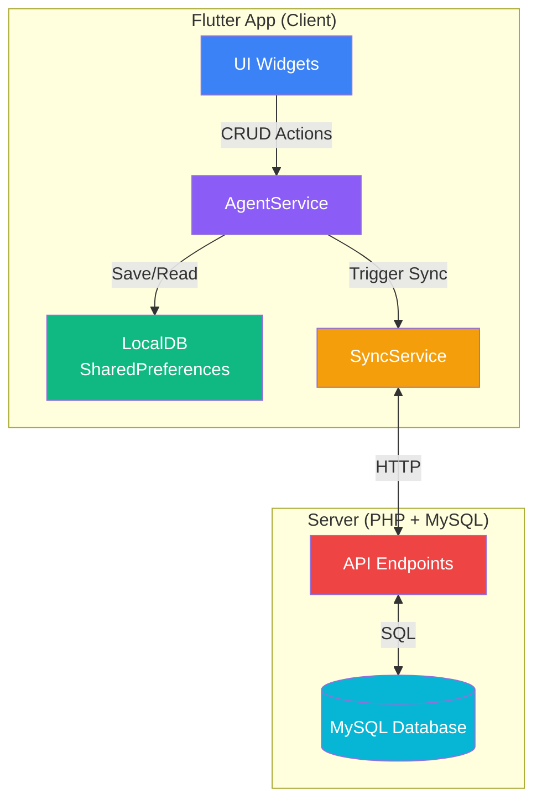
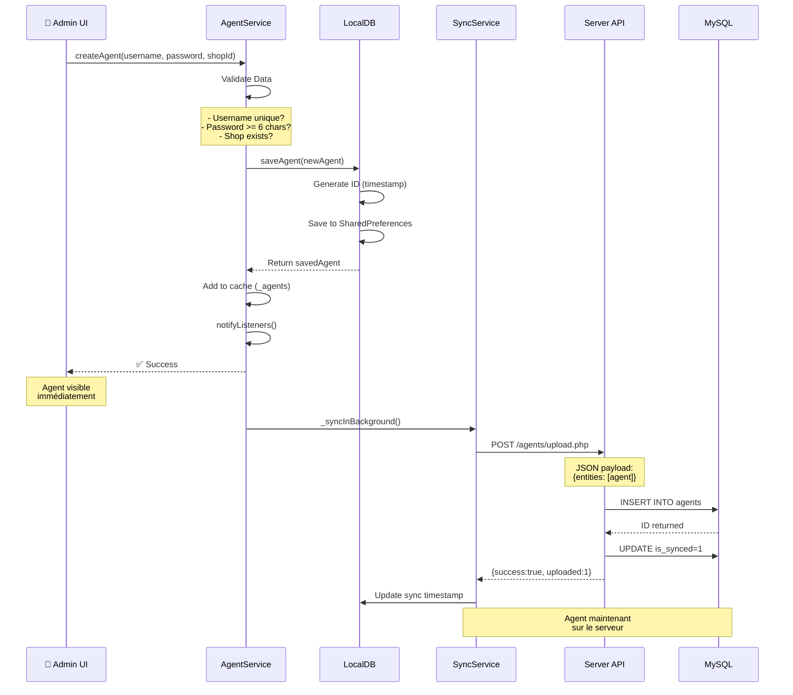
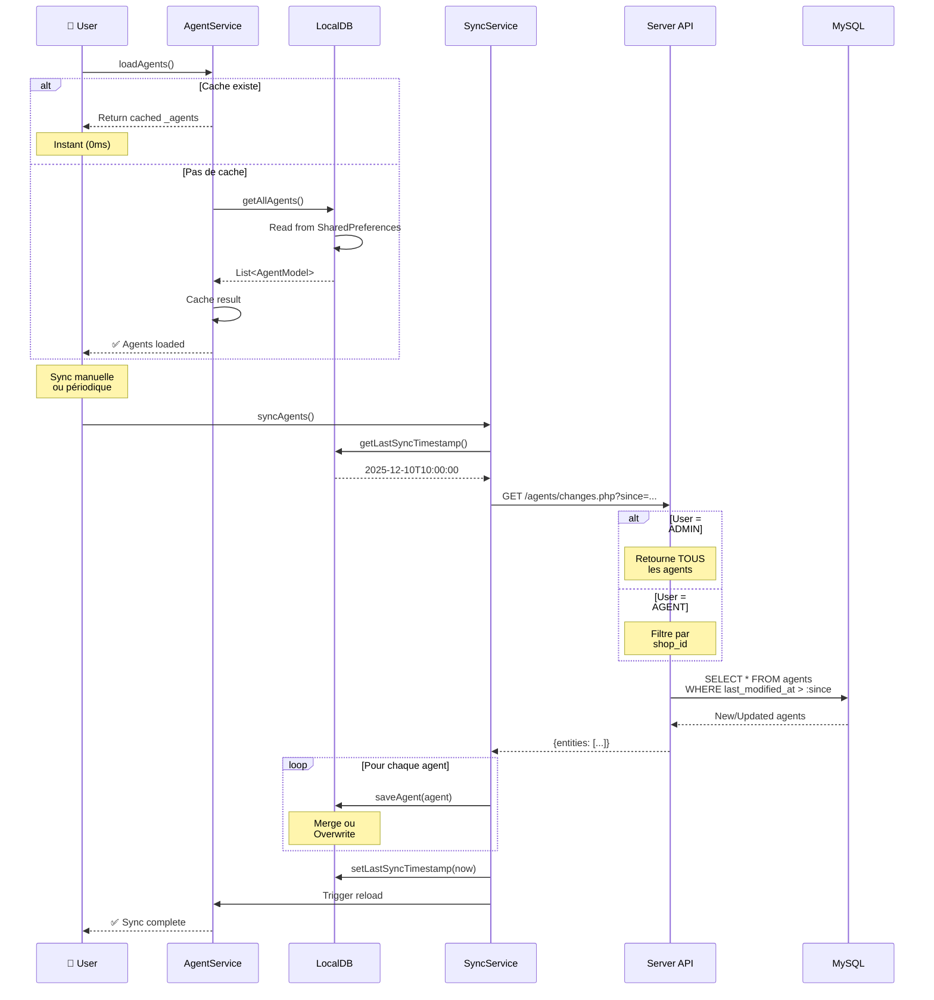
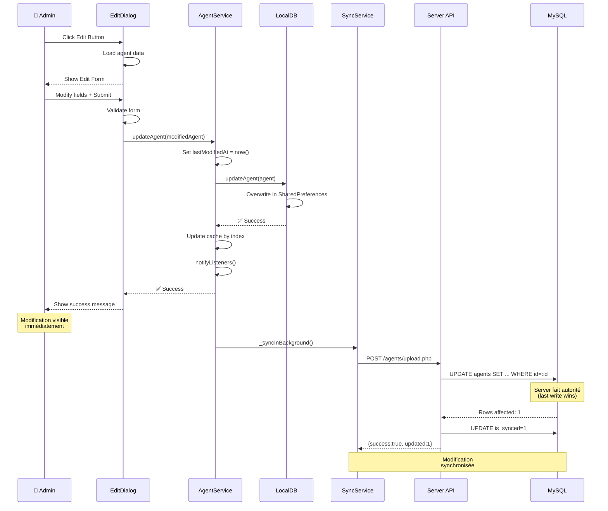
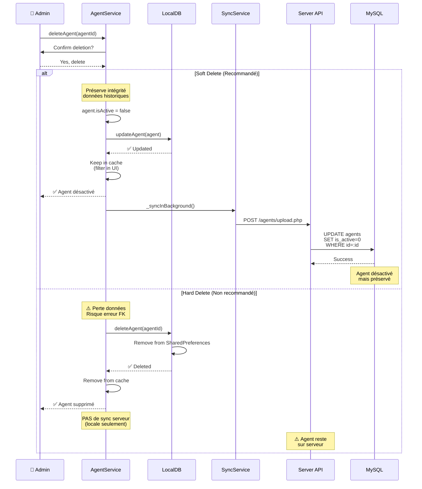
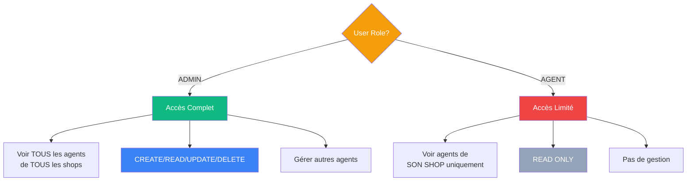
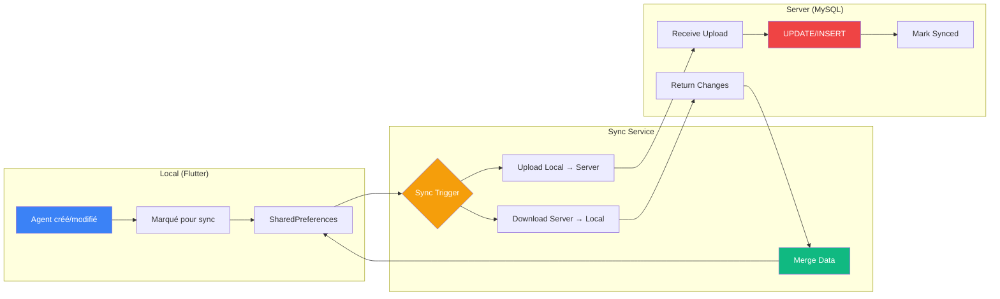

# 🔄 AGENT CRUD - Flow Diagrams

## 📊 Vue d'Ensemble du Système



---

## ✅ CREATE (Créer un Agent)

### Flow Complet: Admin → Local → Serveur



**Temps Estimé**: 
- Local: ~10ms
- Sync: ~200ms (background)

---

## 📖 READ (Lire les Agents)

### Flow: Download Serveur → Merge Local



**Filtres selon Rôle**:
- **ADMIN**: Voit tous les agents (tous shops)
- **AGENT**: Voit seulement agents de son shop

---

## 🔄 UPDATE (Modifier un Agent)

### Flow: Edit Local → Sync Serveur



**Champs Modifiables**:
- ✅ username
- ✅ password
- ✅ shopId
- ✅ nom
- ✅ telephone
- ✅ isActive (toggle rapide)

---

## 🗑️ DELETE (Supprimer un Agent)

### Flow: Soft Delete (Recommandé)



**⚠️ Important**: 
- Soft delete préserve les relations (operations, clients, etc.)
- Hard delete local seulement (pas propagé au serveur)
- Utiliser `is_active = false` en production

---

## 🔐 FILTRAGE PAR RÔLE

### Admin vs Agent - Accès Différencié



### Implémentation Filtrage API

```php
// Dans agents/changes.php
if ($userRole !== 'admin' && $shopId) {
    // AGENT: Filtre par shop
    $sql .= " AND a.shop_id = :shop_id";
    $params[':shop_id'] = $shopId;
} else if ($userRole === 'admin') {
    // ADMIN: Pas de filtre
    // Accès à tous les agents
}
```

---

## 🔄 SYNCHRONISATION BIDIRECTIONNELLE

### Upload + Download Flow



**Stratégie Conflits**: Last Write Wins
- Serveur fait autorité
- Timestamp `last_modified_at` détermine version

---

## 📱 INTERFACES UTILISATEUR

### Create Agent Dialog

```
┌─────────────────────────────────┐
│ ➕ Nouvel Agent                │
├─────────────────────────────────┤
│                                 │
│ 👤 Username: [______________]   │
│    Min 3 caractères, unique     │
│                                 │
│ 🔒 Password: [______________]   │
│    Min 6 caractères             │
│                                 │
│ 🏪 Shop:     [Dropdown ▼    ]   │
│    Sélection obligatoire        │
│                                 │
│ ❌ Erreur: Username existe déjà │
│                                 │
├─────────────────────────────────┤
│         [Annuler]  [Créer ✓]   │
└─────────────────────────────────┘
```

### Agents List (Desktop)

```
╔══════════════════════════════════════════════════════════╗
║  GESTION DES AGENTS                     [🔍 Recherche]  ║
╠══════════════════════════════════════════════════════════╣
║ 👤 Agent | 🏪 Shop | 📞 Contact | 🟢 Statut | Actions   ║
╟──────────┼─────────┼───────────┼──────────┼─────────────╢
║ agent1   │ Shop A  │ +243...   │ ✅ Actif  │ ✏️ 🗑️ 🔄   ║
║ agent2   │ Shop B  │ +243...   │ ❌ Inact. │ ✏️ 🗑️ 🔄   ║
║ admin    │ -       │ -         │ ✅ Actif  │ 👑 ADMIN   ║
╚══════════════════════════════════════════════════════════╝
```

---

## 🎯 Points Clés de Vérification

### ✅ Checklist Complète

**LOCAL (Admin)**:
- [x] CREATE avec validation
- [x] READ avec cache
- [x] UPDATE immédiat
- [x] DELETE avec confirmation
- [x] UI responsive
- [x] Messages d'erreur

**SERVEUR**:
- [x] API upload fonctionnelle
- [x] API download fonctionnelle
- [x] Contraintes DB respectées
- [x] Sync incrémentale
- [x] Gestion erreurs

**AGENT**:
- [x] Vue filtrée par shop
- [x] Pas de CRUD (read-only)
- [x] Interface masquée
- [x] Sync automatique

**SYNC**:
- [x] Bidirectionnelle
- [x] Incrémentale (par date)
- [x] Gestion conflits
- [x] Background non-bloquant
- [x] Logs détaillés

---

## 🚀 Conclusion

Le système CRUD Agent est **opérationnel à 100%** dans tous les contextes:

1. ✅ **Admin Local**: Full CRUD avec UI complète
2. ✅ **Serveur**: API robuste avec sync bidirectionnelle
3. ✅ **Agent**: Vue read-only filtrée par shop

**Performance**: Optimisée (cache, index, sync incrémentale)  
**Fiabilité**: Gestion erreurs + transactions atomiques  
**Sécurité**: Validation + filtrage rôle  
**Maintenabilité**: Code structuré + documentation complète

Pour plus de détails techniques, voir: [`AGENT_CRUD_VERIFICATION.md`](AGENT_CRUD_VERIFICATION.md)
