# ✅ AUTOMATIC DELETION SYNCHRONIZATION - AGENTS & SHOPS

## 📋 Overview

This feature automatically detects and removes **agents** and **shops** that have been deleted on the server from all agent terminals. It uses the same mechanism as the operations deletion synchronization.

## 🎯 Problem Solved

**Before:**
- Admin deletes an agent/shop on the server
- Agent terminals still show the deleted agent/shop
- Data inconsistency between server and clients
- Manual sync required to clean up

**After:**
- Admin deletes an agent/shop on the server
- Agent terminals automatically detect and remove it
- Automatic cleanup during sync cycle
- Data stays consistent automatically ✅

## 🔄 How It Works

### Synchronization Flow

```mermaid
sequenceDiagram
    participant Admin as 👑 Admin Terminal
    participant Server as 🗄️ MySQL Server
    participant API as 🌐 Check Deleted API
    participant Agent as 📱 Agent Terminal
    
    Note over Admin: Admin deletes<br/>Agent/Shop ID 5
    Admin->>Server: DELETE FROM agents<br/>WHERE id = 5
    Server-->>Admin: ✅ Deleted
    
    Note over Agent: Auto sync every 2 min<br/>or manual loadAgents()
    Agent->>Agent: Extract local IDs<br/>[1, 2, 3, 4, 5]
    Agent->>API: POST /check_deleted.php<br/>{agent_ids: [1,2,3,4,5]}
    API->>Server: SELECT id FROM agents<br/>WHERE id IN (...)
    Server-->>API: Existing IDs: [1,2,3,4]
    API-->>Agent: {deleted_agents: [5]}
    
    Note over Agent: 🗑️ Local cleanup
    Agent->>Agent: deleteAgent(5) from LocalDB
    Agent->>Agent: Remove from cache
    Agent->>Agent: notifyListeners()
    Agent->>Agent: 🎨 UI refreshes
    
    Note over Agent: ✅ Agent no longer visible!
```



## 📁 Files Created/Modified

### 🆕 NEW Files (Server - PHP)

#### 1. `server/api/sync/agents/check_deleted.php`
API endpoint to check which agents have been deleted from the server.

**Endpoint:** `POST /api/sync/agents/check_deleted.php`

**Request:**
```json
{
  "agent_ids": [1, 2, 3, 4, 5]
}
```

**Response:**
```json
{
  "success": true,
  "deleted_agents": [3, 5],
  "existing_count": 3,
  "deleted_count": 2,
  "message": "2 agent(s) supprimé(s) trouvé(s)"
}
```

**Logic:**
```php
// Find existing agents on server
SELECT id FROM agents WHERE id IN (1, 2, 3, 4, 5)
// Returns: [1, 2, 4]

// Calculate deleted = local IDs - server IDs
$deletedAgents = array_diff([1,2,3,4,5], [1,2,4]);
// Result: [3, 5]
```

---

#### 2. `server/api/sync/shops/check_deleted.php`
API endpoint to check which shops have been deleted from the server.

**Endpoint:** `POST /api/sync/shops/check_deleted.php`

**Request:**
```json
{
  "shop_ids": [10, 20, 30, 40]
}
```

**Response:**
```json
{
  "success": true,
  "deleted_shops": [30],
  "existing_count": 3,
  "deleted_count": 1,
  "message": "1 shop(s) supprimé(s) trouvé(s)"
}
```

---

### 📝 MODIFIED Files (Client - Dart)

#### 1. `lib/services/agent_service.dart`

**New Methods Added:**

```dart
/// Vérifie les agents supprimés sur le serveur
Future<void> _checkForDeletedAgents() async

/// Supprime localement les agents supprimés
Future<void> _removeDeletedAgentsLocally(List<int> deletedAgentIds) async
```

**Modified Method:**
```dart
Future<void> loadAgents({...}) async {
  
  // ✅ NEW: Check for deleted agents on server
  await _checkForDeletedAgents();
  
  _agents = await LocalDB.instance.getAllAgents();
  // ...
}
```

**Integration:**
- Called automatically during `loadAgents()`
- Runs during sync cycle every 2 minutes
- Non-blocking - errors don't stop sync

---

#### 2. `lib/services/shop_service.dart`

**New Methods Added:**

```dart
/// Vérifie les shops supprimés sur le serveur
Future<void> _checkForDeletedShops() async

/// Supprime localement les shops supprimés
Future<void> _removeDeletedShopsLocally(List<int> deletedShopIds) async
```

**Modified Method:**
```dart
Future<void> loadShops({...}) async {
  
  // ✅ NEW: Check for deleted shops on server
  await _checkForDeletedShops();
  
  final allShops = await LocalDB.instance.getAllShops();
  // ...
}
```

---

## 🔍 Verification Logic

### ID Comparison Algorithm

```dart
// 1. Get local IDs
final localIds = [1, 2, 3, 4, 5];

// 2. Query server for existing IDs
POST /check_deleted.php {agent_ids: [1,2,3,4,5]}

// 3. Server returns existing IDs
final serverIds = [1, 2, 4]; // IDs 3 and 5 deleted

// 4. Calculate difference (local - server = deleted)
final deletedIds = localIds - serverIds;
// Result: [3, 5]

// 5. Remove deleted IDs locally
for (id in deletedIds) {
  await LocalDB.instance.deleteAgent(id);
  _agents.removeWhere((a) => a.id == id);
}
```

---

## ⏱️ When Verification Happens

| Trigger | Frequency | Automatic |
|---------|-----------|-----------|
| **Auto Sync** | Every 2 minutes | ✅ Yes |
| **Manual Refresh** | User-triggered | ✅ Yes |
| **App Startup** | Once per session | ✅ Yes |
| **loadAgents()/loadShops()** | On each call | ✅ Yes |

---

## 🛡️ Error Handling

**Non-blocking Verification:**
```dart
try {
  await _checkForDeletedAgents();
} catch (e) {
  debugPrint('⚠️ Erreur vérification: $e');
  // Continue loading - don't block sync
}
```

**Timeout Protection:**
```dart
final response = await http.post(
  url,
  body: jsonEncode({'agent_ids': agentIds}),
).timeout(
  const Duration(seconds: 15),
  onTimeout: () {
    throw Exception('Timeout');
  },
);
```

---

## 📊 Data Sources Cleaned

When a deletion is detected, the entity is removed from:

1. **LocalDB (SharedPreferences)** ✅
   ```dart
   await LocalDB.instance.deleteAgent(agentId);
   ```

2. **In-Memory Cache** ✅
   ```dart
   _agents.removeWhere((a) => a.id == agentId);
   ```

3. **UI (via notifyListeners)** ✅
   ```dart
   notifyListeners(); // Refresh UI
   ```

---

## 🔒 Security Considerations

**Server-Side Validation:**
```php
// Only returns IDs that exist in database
$sql = "SELECT id FROM agents WHERE id IN (...)";
```

**SQL Injection Protection:**
```php
// Use prepared statements
$placeholders = implode(',', array_fill(0, count($agentIds), '?'));
$stmt = $pdo->prepare($sql);
$stmt->execute($agentIds);
```

**Empty Array Handling:**
```php
if (empty($agentIds)) {
    echo json_encode([
        'success' => true,
        'deleted_agents' => []
    ]);
    exit;
}
```

---

## 📈 Performance

**Optimized Queries:**
- Single bulk query instead of individual checks
- Returns only IDs (minimal data transfer)
- Index on `id` column (fast lookups)

**Bandwidth:**
```
Request:  ~50 bytes per ID
Response: ~30 bytes per deleted ID
Total:    ~80 bytes per verification
```

**Example:**
```
100 agents = ~8 KB per check
5 deleted = ~150 bytes in response
```

---

## ✅ Testing

### Test Scenarios

#### 1. Agent Deletion
```bash
# Admin terminal
DELETE FROM agents WHERE id = 5;

# Agent terminal (after sync)
await AgentService.instance.loadAgents();
// Agent ID 5 automatically removed locally
```

#### 2. Shop Deletion
```bash
# Admin terminal
DELETE FROM shops WHERE id = 10;

# Agent terminal (after sync)
await ShopService.instance.loadShops();
// Shop ID 10 automatically removed locally
```

#### 3. Multiple Deletions
```bash
# Admin deletes 3 agents
DELETE FROM agents WHERE id IN (3, 7, 12);

# Next sync detects all 3
// Logs: "🗑️ 3 agent(s) supprimé(s) détecté(s)"
```

---

## 🔄 Comparison with Operations Deletion

| Feature | Operations | Agents | Shops |
|---------|-----------|--------|-------|
| **Check Endpoint** | `check_deleted.php` | `check_deleted.php` | `check_deleted.php` |
| **ID Parameter** | `code_ops_list` | `agent_ids` | `shop_ids` |
| **Response Key** | `deleted_operations` | `deleted_agents` | `deleted_shops` |
| **Trigger** | On sync cycle | On loadAgents() | On loadShops() |
| **Cleanup** | 5 sources | 2 sources | 2 sources |

---

## 🎉 Benefits

1. **Automatic Cleanup** ✅
   - No manual intervention required
   - Consistent data across all terminals

2. **Server Authority** ✅
   - Server is source of truth
   - Local data stays synchronized

3. **Non-Intrusive** ✅
   - Silent background operation
   - Doesn't block UI or sync

4. **Reliable** ✅
   - Error-tolerant (continues on failure)
   - Timeout protected (15s limit)

5. **Efficient** ✅
   - Bulk checking (not individual requests)
   - Minimal bandwidth usage

---

## 🚀 Future Enhancements

1. **Soft Delete Support**
   - Check `is_active` flag instead of physical deletion
   - Allow restore functionality

2. **Deletion Audit Trail**
   - Log who deleted what and when
   - Track deletion reasons

3. **Cascade Deletion**
   - Auto-delete related entities
   - Example: Delete agents when shop is deleted

4. **Real-Time Notifications**
   - WebSocket/Push notifications
   - Instant updates without waiting for sync

---

## 📝 Summary

This feature ensures that **agents and shops deleted by admins are automatically removed from all agent terminals**, maintaining data consistency across the entire system.

**Key Points:**
- ✅ Automatic detection during sync
- ✅ Compares local IDs with server IDs
- ✅ Removes deleted entities locally
- ✅ Non-blocking and error-tolerant
- ✅ Minimal bandwidth usage

**Workflow:**
1. Admin deletes agent/shop on server
2. Agent syncs (every 2 minutes)
3. System checks local vs server IDs
4. Missing IDs are deleted locally
5. UI automatically refreshes ✨
