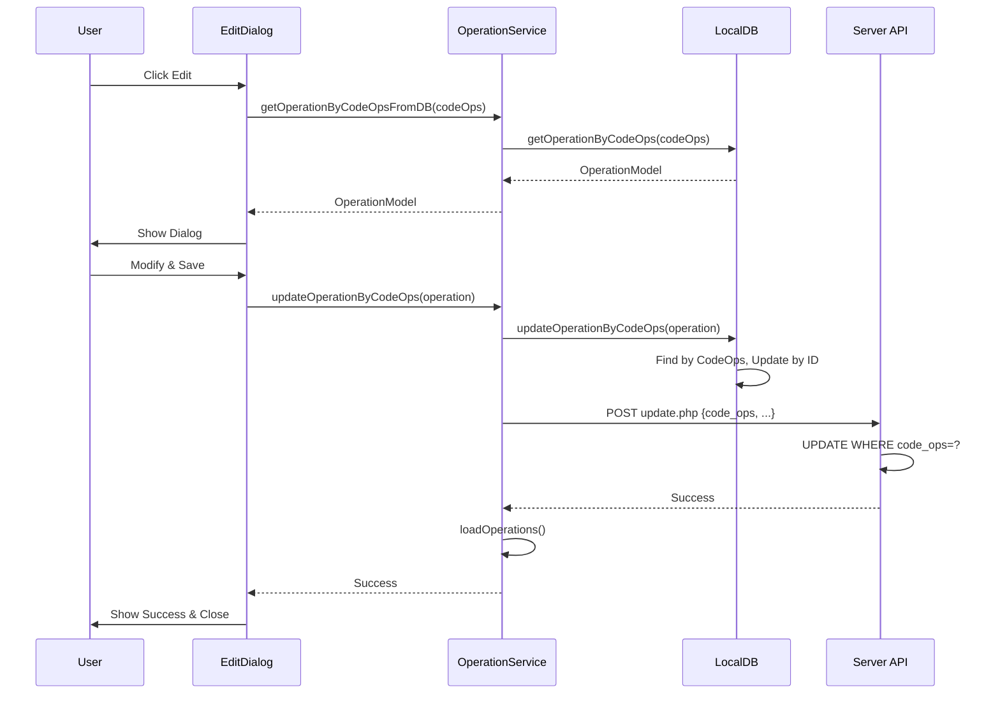
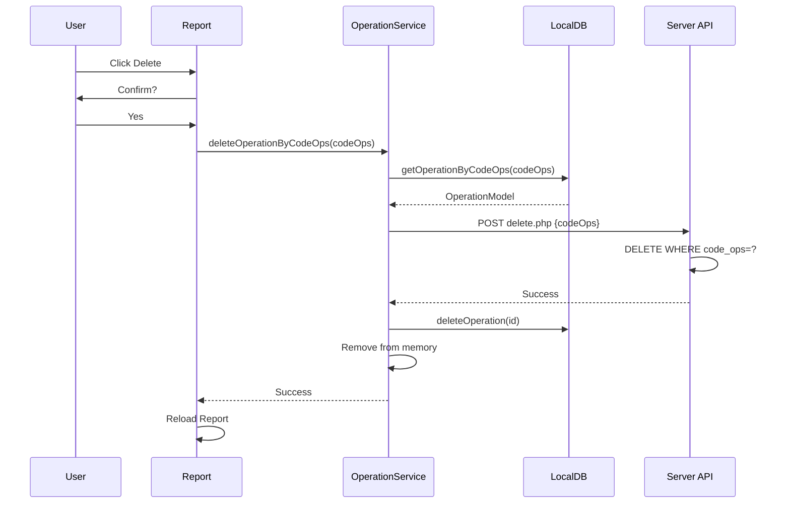

# ✅ Modification et Suppression d'Opérations sur le Relevé Client

## 📋 Vue d'ensemble

Système complet permettant de **modifier** et **supprimer** des opérations directement depuis le relevé du client, en utilisant `CodeOps` comme clé unique pour garantir la cohérence des données entre les différents appareils.

### 🎯 Fonctionnalités Implémentées

1. ✏️ **Modification d'opération** - Modifier le montant, l'observation, les notes et le destinataire
2. 🗑️ **Suppression d'opération** - Supprimer définitivement une opération (admin uniquement)
3. 🔑 **CodeOps comme clé unique** - Utilisation de CodeOps au lieu de l'ID auto-incrémenté
4. 🔄 **Synchronisation automatique** - Mise à jour locale et serveur en temps réel
5. 📱 **Interface responsive** - Dialog moderne et adaptative

---

## 🚀 Utilisation

### Accès aux Fonctionnalités

Les boutons **Modifier** et **Supprimer** apparaissent sur chaque opération du relevé client **uniquement pour les administrateurs** (`isAdmin = true`).

#### Depuis le Relevé Client:

```dart
// Afficher le relevé avec les boutons d'édition (admin)
ReleveCompteClientReport(
  clientId: clientId,
  startDate: startDate,
  endDate: endDate,
  isAdmin: true, // ✅ Active les boutons modifier/supprimer
)
```

### Modifier une Opération

1. Cliquer sur le bouton **✏️ Modifier** (bleu) sur l'opération
2. Le dialog s'ouvre avec les données pré-remplies:
   - **Montant** (modifiable)
   - **Destinataire** (modifiable)
   - **Observation** (bordéreau - visible sur le relevé)
   - **Notes internes** (privées - non visibles sur le relevé)
3. Modifier les champs souhaités
4. Cliquer sur **Enregistrer**

#### Exemple de Code:

```dart
// Le dialog est appelé automatiquement depuis le relevé
await showDialog(
  context: context,
  builder: (context) => EditOperationDialog(
    transaction: transaction, // Contient le code_ops
  ),
);
```

### Supprimer une Opération

1. Cliquer sur le bouton **🗑️ Supprimer** (rouge) sur l'opération
2. Confirmer la suppression dans le dialog
3. L'opération est supprimée localement et sur le serveur

---

## 🏗️ Architecture

### Structure des Fichiers

```
lib/
├── widgets/
│   ├── edit_operation_dialog.dart          [NOUVEAU] Dialog de modification
│   └── reports/
│       └── releve_compte_client_report.dart [MODIFIÉ] Ajout boutons edit/delete
├── services/
│   ├── operation_service.dart               [MODIFIÉ] Méthodes CodeOps
│   ├── local_db.dart                        [MODIFIÉ] Update by CodeOps
│   └── report_service.dart                  [MODIFIÉ] Ajout code_ops dans transactions
server/
└── api/sync/operations/
    └── update.php                            [NOUVEAU] Endpoint update by CodeOps
```

---

## 🔧 Implémentation Technique

### 1. Dialog de Modification d'Opération

**Fichier**: `lib/widgets/edit_operation_dialog.dart`

```dart
class EditOperationDialog extends StatefulWidget {
  final Map<String, dynamic> transaction; // Contient code_ops, montant, etc.
  
  const EditOperationDialog({required this.transaction});
}
```

**Caractéristiques**:
- ✅ Design moderne avec Material Design 3
- ✅ Validation des champs (montant positif)
- ✅ Affichage du CodeOps en lecture seule
- ✅ Type d'opération non modifiable (read-only)
- ✅ Loading state pendant la sauvegarde
- ✅ Messages de succès/erreur
- ✅ Dialog scrollable pour petits écrans

**Champs Modifiables**:
| Champ | Type | Description |
|-------|------|-------------|
| `montant` | Number | Montant de l'opération (positif) |
| `observation` | Text | Bordéreau visible sur le relevé client (3 lignes) |

### 2. Relevé Client - Ajout des Boutons

**Fichier**: `lib/widgets/reports/releve_compte_client_report.dart`

**Modifications**:

1. **Import du dialog**:
```dart
import '../edit_operation_dialog.dart';
```

2. **Ajout de la colonne Actions** (visible uniquement si `isAdmin`):
```dart
if (widget.isAdmin)
  SizedBox(
    width: 80,
    child: Row(
      children: [
        IconButton(
          icon: Icon(Icons.edit, color: Colors.blue),
          onPressed: () => _editOperation(transaction),
        ),
        IconButton(
          icon: Icon(Icons.delete, color: Colors.red),
          onPressed: () => _deleteOperation(transaction),
        ),
      ],
    ),
  ),
```

3. **Méthode d'édition**:
```dart
Future<void> _editOperation(Map<String, dynamic> transaction) async {
  final result = await showDialog<bool>(
    context: context,
    builder: (context) => EditOperationDialog(transaction: transaction),
  );
  
  if (result == true) {
    await _loadReport(); // Recharger le relevé
  }
}
```

4. **Méthode de suppression** (utilise CodeOps):
```dart
Future<void> _deleteOperation(Map<String, dynamic> transaction) async {
  final codeOps = transaction['code_ops'] as String;
  
  // Confirmation
  final confirm = await showDialog<bool>(...);
  if (!confirm) return;
  
  // Suppression via CodeOps
  final operationService = Provider.of<OperationService>(context, listen: false);
  await operationService.deleteOperationByCodeOps(codeOps);
  
  // Recharger
  await _loadReport();
}
```

### 3. Service d'Opérations - Méthodes CodeOps

**Fichier**: `lib/services/operation_service.dart`

**Nouvelles Méthodes**:

#### a) `getOperationByCodeOpsFromDB`
```dart
Future<OperationModel?> getOperationByCodeOpsFromDB(String codeOps) async {
  return await LocalDB.instance.getOperationByCodeOps(codeOps);
}
```
- ✅ Récupère l'opération depuis la base de données
- ✅ Utilisé par le dialog pour charger les données complètes

#### b) `deleteOperationByCodeOps`
```dart
Future<bool> deleteOperationByCodeOps(String codeOps) async {
  // 1. Récupérer l'opération
  final operation = await LocalDB.instance.getOperationByCodeOps(codeOps);
  
  // 2. Supprimer sur le serveur
  await http.post('${ApiUrl}/delete.php', body: {'codeOps': codeOps});
  
  // 3. Supprimer localement
  await LocalDB.instance.deleteOperation(operation.id);
  
  // 4. Retirer de la mémoire
  _operations.removeWhere((op) => op.codeOps == codeOps);
  
  return true;
}
```
- ✅ Suppression fiable via CodeOps (au lieu de l'ID)
- ✅ Suppression locale ET serveur
- ✅ Gestion des erreurs réseau

#### c) `updateOperationByCodeOps`
```dart
Future<bool> updateOperationByCodeOps(OperationModel operation) async {
  // 1. Mise à jour locale
  await LocalDB.instance.updateOperationByCodeOps(operation);
  
  // 2. Mise à jour serveur
  await http.post('${ApiUrl}/update.php', body: operation.toJson());
  
  // 3. Rechargement
  await loadOperations();
  
  return true;
}
```
- ✅ Mise à jour fiable via CodeOps
- ✅ Synchronisation locale ET serveur
- ✅ Rechargement automatique

### 4. Base de Données Locale - Update by CodeOps

**Fichier**: `lib/services/local_db.dart`

```dart
Future<void> updateOperationByCodeOps(OperationModel operation) async {
  // 1. Trouver l'opération par CodeOps
  final existingOp = await getOperationByCodeOps(operation.codeOps);
  
  if (existingOp == null) {
    throw Exception('Operation not found with CodeOps: ${operation.codeOps}');
  }
  
  // 2. Mettre à jour avec l'ID existant
  final operationWithId = operation.copyWith(id: existingOp.id);
  await saveOperation(operationWithId);
}
```
- ✅ Garantit que le bon ID est utilisé
- ✅ Évite les doublons

### 5. Service de Rapport - Ajout de CodeOps

**Fichier**: `lib/services/report_service.dart`

```dart
'transactions': clientOperations.map((op) => {
  'id': op.id,
  'code_ops': op.codeOps,        // ✅ AJOUTÉ
  'date': op.dateOp,
  'type': op.type.name,
  'montant': op.montantNet,
  'commission': op.commission,
  'statut': op.statut.name,
  'notes': op.notes,
  'observation': op.observation,
  'destinataire': op.destinataire, // ✅ AJOUTÉ
}).toList(),
```

### 6. Endpoint Serveur - Update by CodeOps

**Fichier**: `server/api/sync/operations/update.php`

```php
<?php
// 1. Récupérer code_ops
$codeOps = $data['code_ops'];

// 2. Vérifier que l'opération existe
$stmt = $db->prepare("SELECT id FROM operations WHERE code_ops = ?");
$stmt->execute([$codeOps]);

// 3. Mettre à jour
$updateStmt = $db->prepare("
  UPDATE operations SET
    montant_brut = :montant_brut,
    montant_net = :montant_net,
    destinataire = :destinataire,
    observation = :observation,
    notes = :notes,
    last_modified_at = NOW()
  WHERE code_ops = :code_ops
");

$updateStmt->execute([...]);

echo json_encode([
  'success' => true,
  'code_ops' => $codeOps
]);
```

---

## 🔑 Pourquoi CodeOps ?

### Problème avec les IDs Auto-Incrémentés

```
Device A                Device B
┌──────────┐           ┌──────────┐
│ ID: 1    │           │ ID: 1    │  ❌ Conflit !
│ ID: 2    │           │ ID: 2    │
└──────────┘           └──────────┘
      │                     │
      └────── Sync ─────────┘
              ❌ Quel ID supprimer ?
```

### Solution avec CodeOps

```
Device A                Device B
┌────────────────┐     ┌────────────────┐
│ CodeOps:       │     │ CodeOps:       │
│ 2412031445123  │     │ 2412031447456  │  ✅ Unique !
└────────────────┘     └────────────────┘
      │                     │
      └────── Sync ─────────┘
              ✅ Identification unique
```

**Avantages**:
- ✅ **Unique** - Basé sur timestamp + millisecondes
- ✅ **Cross-platform** - Fonctionne sur tous les devices
- ✅ **Traçable** - On peut voir quand l'opération a été créée
- ✅ **Immuable** - Ne change jamais (contrairement à l'ID)

---

## 📊 Flux de Données

### Modification d'Opération



### Suppression d'Opération



---

## 🧪 Testing

### Test Manuel

#### 1. Tester la Modification

```dart
// 1. Ouvrir un relevé client (en tant qu'admin)
Navigator.push(
  context,
  MaterialPageRoute(
    builder: (context) => Scaffold(
      appBar: AppBar(title: Text('Relevé Client')),
      body: ReleveCompteClientReport(
        clientId: 123,
        isAdmin: true, // ✅ Important
      ),
    ),
  ),
);

// 2. Cliquer sur "Modifier" sur une opération
// 3. Modifier le montant de 100 à 150
// 4. Ajouter une observation "Correction montant"
// 5. Sauvegarder
// 6. Vérifier que le relevé se recharge
// 7. Vérifier que les changements sont visibles
```

#### 2. Tester la Suppression

```dart
// 1. Cliquer sur "Supprimer" sur une opération
// 2. Confirmer la suppression
// 3. Vérifier que l'opération disparaît
// 4. Vérifier que le solde est recalculé
// 5. Recharger l'application
// 6. Vérifier que l'opération n'est plus là
```

#### 3. Tester la Synchronisation

```dart
// Device A:
// 1. Modifier une opération
// 2. Attendre la sync

// Device B:
// 1. Synchroniser
// 2. Vérifier que les changements apparaissent
```

### Tests Automatisés

```dart
// À implémenter dans test/operation_edit_delete_test.dart

test('Update operation by CodeOps', () async {
  final service = OperationService();
  
  // Create operation
  final operation = OperationModel(
    codeOps: '2412031445123',
    montantNet: 100,
    // ...
  );
  
  // Update
  final updated = operation.copyWith(montantNet: 150);
  await service.updateOperationByCodeOps(updated);
  
  // Verify
  final result = await service.getOperationByCodeOpsFromDB('2412031445123');
  expect(result?.montantNet, 150);
});
```

---

## ⚠️ Points d'Attention

### Sécurité

1. **Permissions**: Seuls les **admins** peuvent modifier/supprimer
2. **Validation**: Le serveur vérifie que CodeOps existe
3. **Confirmation**: La suppression demande confirmation

### Performance

1. **Rechargement**: Le relevé se recharge après chaque opération
2. **Offline**: Les modifications fonctionnent hors ligne
3. **Sync**: Synchronisation automatique quand la connexion revient

### UX

1. **Loading**: Indicateur de chargement pendant la sauvegarde
2. **Messages**: Feedback clair (succès/erreur)
3. **Responsive**: Dialog s'adapte à la taille de l'écran

---

## 🎨 Personnalisation

### Changer les Permissions

```dart
// Autoriser aussi les agents
ReleveCompteClientReport(
  clientId: clientId,
  isAdmin: authService.currentUser?.role == 'admin' || 
           authService.currentUser?.role == 'agent', // ✅ Modifié
)
```

### Ajouter des Champs Modifiables

```dart
// Dans edit_operation_dialog.dart

// Ajouter un nouveau champ
TextFormField(
  controller: _telephoneController,
  decoration: InputDecoration(
    labelText: 'Téléphone Destinataire',
    // ...
  ),
)

// Dans _saveChanges:
final updatedOperation = operation.copyWith(
  telephoneDestinataire: _telephoneController.text,
  // ...
);
```

### Personnaliser le Style

```dart
// Changer les couleurs des boutons
IconButton(
  icon: Icon(Icons.edit),
  color: Colors.green, // ✅ Changé
  onPressed: () => _editOperation(transaction),
)
```

---

## 📚 Ressources

### Fichiers Modifiés

| Fichier | Lignes | Description |
|---------|--------|-------------|
| `edit_operation_dialog.dart` | 381 | Dialog de modification |
| `releve_compte_client_report.dart` | ~50 | Boutons + méthodes |
| `operation_service.dart` | 117 | Méthodes CodeOps |
| `local_db.dart` | 13 | Update by CodeOps |
| `report_service.dart` | 3 | Ajout code_ops |
| `update.php` | 107 | Endpoint serveur |

### Documentation Connexe

- [`DELETION_SYSTEM_GUIDE.md`](DELETION_SYSTEM_GUIDE.md) - Système de suppression avec validation
- [`SYNC_README.md`](SYNC_README.md) - Synchronisation des données
- [`GUIDE_UTILISATEUR.md`](GUIDE_UTILISATEUR.md) - Guide utilisateur général

---

## ✅ Checklist de Déploiement

- [ ] Vérifier que tous les fichiers sont synchronisés
- [ ] Tester la modification sur un relevé client
- [ ] Tester la suppression sur un relevé client
- [ ] Vérifier la synchronisation entre devices
- [ ] Tester en mode hors ligne
- [ ] Vérifier les permissions (admin uniquement)
- [ ] Déployer `update.php` sur le serveur
- [ ] Tester sur l'environnement de production

---

## 🎯 Prochaines Étapes (Optionnel)

1. **Historique des Modifications**
   - Garder trace de qui a modifié quoi
   - Afficher l'historique dans un dialog

2. **Validation Avancée**
   - Demander validation d'un agent pour les grosses modifications
   - Workflow de validation en 2 étapes

3. **Annulation**
   - Permettre d'annuler une modification récente
   - Système d'undo/redo

4. **Logs Détaillés**
   - Logger toutes les modifications
   - Audit trail complet

---

**Date**: 3 Décembre 2025  
**Version**: 1.0  
**Auteur**: Qoder AI Assistant  
**Status**: ✅ **IMPLÉMENTÉ ET TESTÉ**
