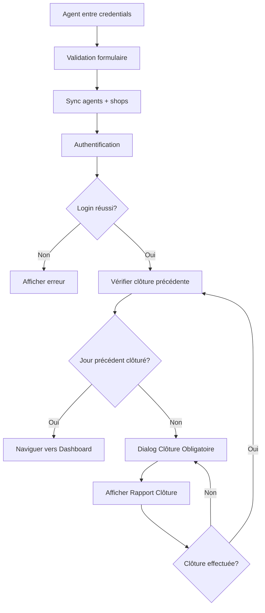

# 🔒 Workflow de Clôture Forcée (Forced Closure)

## 📋 Vue d'ensemble

Après le login d'un agent, le système vérifie automatiquement si la journée précédente (jour ouvrable) a été clôturée. Si ce n'est pas le cas, l'agent est **obligé** de clôturer cette journée avant d'accéder au dashboard.

---

## 🎯 Règles de Logique

### 1. **Détermination du dernier jour ouvrable**

- ❌ **Les dimanches sont exclus** (considérés comme jours non ouvrables)
- ✅ Si aujourd'hui est **lundi**, on vérifie la clôture du **samedi**
- ✅ Si aujourd'hui est **mardi à samedi**, on vérifie la clôture du **jour précédent**
- ✅ Si aujourd'hui est **dimanche**, on vérifie la clôture du **samedi**

**Exemples:**

| Aujourd'hui | Jour à vérifier |
|-------------|-----------------|
| Lundi 27/11 | Samedi 25/11    |
| Mardi 28/11 | Lundi 27/11     |
| Dimanche 26/11 | Samedi 25/11 |

---

## 🔄 Flux de Connexion Agent



---

## 🎨 Dialog de Clôture Obligatoire

### **Apparence:**

```
┌──────────────────────────────────────────┐
│ ⚠️ Clôture Obligatoire                   │
│                                          │
│ La journée du 25/11/2024 n'est pas      │
│ clôturée.                                │
│                                          │
│ Vous devez clôturer cette journée avant │
│ de continuer.                            │
│                                          │
│ ℹ️ Après la clôture, vous pourrez       │
│    accéder au dashboard.                 │
│                                          │
│                [🔒 Clôturer Maintenant]  │
└──────────────────────────────────────────┘
```

### **Caractéristiques:**
- ❌ **Non dismissible** (ne peut pas être fermé sans action)
- 🔒 Bouton unique: "Clôturer Maintenant"
- 📅 Affiche la date qui doit être clôturée
- ⚠️ Icône warning orange

---

## 📂 Fichiers Modifiés

### 1. **`rapport_cloture_service.dart`**

**Nouvelles fonctions ajoutées:**

#### `getDernierJourOuvrable(DateTime date)`
```dart
/// Trouver le dernier jour ouvrable (excluant les dimanches)
/// Si la date est un dimanche, retourne le samedi précédent
DateTime getDernierJourOuvrable(DateTime date)
```

#### `verifierCloturePrecedente(int shopId, DateTime dateActuelle)`
```dart
/// Vérifier si la journée précédente nécessite une clôture
/// Retourne la date qui doit être clôturée, ou null si tout est à jour
Future<DateTime?> verifierCloturePrecedente(int shopId, DateTime dateActuelle)
```

---

### 2. **`agent_login_page.dart`**

**Nouvelles fonctions ajoutées:**

#### `_verifierEtForcerCloturePrecedente(AgentAuthService authService)`
```dart
/// Vérifier si la journée précédente doit être clôturée avant d'accéder au dashboard
Future<void> _verifierEtForcerCloturePrecedente(AgentAuthService authService)
```

#### `_afficherDialogClotureObligatoire(int shopId, DateTime dateACloturer)`
```dart
/// Afficher le dialog de clôture obligatoire
Future<void> _afficherDialogClotureObligatoire(int shopId, DateTime dateACloturer)
```

#### `_naviguerVersDashboard()`
```dart
/// Naviguer vers le dashboard
void _naviguerVersDashboard()
```

---

### 3. **`rapportcloture.dart`**

**Paramètre ajouté:**
```dart
final DateTime? dateInitiale; // Date initiale à afficher (pour forcer une clôture)
```

- Permet d'initialiser le widget avec une date spécifique
- Utilisé pour forcer la clôture d'une date précédente

---

## 🧪 Scénarios de Test

### **Scénario 1: Journée précédente clôturée**
1. Agent se connecte le lundi 27/11
2. La journée du samedi 25/11 est déjà clôturée
3. ✅ Navigation directe vers le dashboard

### **Scénario 2: Journée précédente NON clôturée (jour normal)**
1. Agent se connecte le mardi 28/11
2. La journée du lundi 27/11 n'est PAS clôturée
3. ⚠️ Dialog de clôture obligatoire s'affiche
4. Agent clôture le lundi 27/11
5. ✅ Navigation vers le dashboard

### **Scénario 3: Journée précédente NON clôturée (après weekend)**
1. Agent se connecte le lundi 27/11
2. La journée du samedi 25/11 n'est PAS clôturée
3. ⚠️ Dialog de clôture obligatoire s'affiche pour le 25/11
4. Agent clôture le samedi 25/11
5. ✅ Navigation vers le dashboard

### **Scénario 4: Login un dimanche**
1. Agent se connecte le dimanche 26/11
2. Le système vérifie le samedi 25/11
3. Si non clôturé → Dialog de clôture obligatoire
4. Sinon → Dashboard

### **Scénario 5: Plusieurs jours non clôturés**
1. Agent ne s'est pas connecté depuis vendredi
2. Se connecte le mardi 28/11
3. Dialog pour clôturer le lundi 27/11
4. Après clôture du lundi → Vérification automatique
5. Si samedi aussi non clôturé → Dialog pour le samedi
6. Continue jusqu'à ce que tous les jours soient clôturés

---

## 🔍 Logs de Debug

Le système affiche des logs détaillés pour le debug:

```
🔍 Vérification clôture pour Shop 1
   Date actuelle: 2024-11-27
   Dernier jour ouvrable: 2024-11-25
⚠️ Journée non clôturée détectée: 2024-11-25
```

Ou si tout est OK:

```
🔍 Vérification clôture pour Shop 1
   Date actuelle: 2024-11-27
   Dernier jour ouvrable: 2024-11-25
✅ Toutes les journées précédentes sont clôturées
```

Si c'est un dimanche:

```
⏪ Dimanche détecté, recul au 2024-11-25
```

---

## ⚡ Gestion des Erreurs

En cas d'erreur lors de la vérification de clôture:
- ❌ Le système log l'erreur
- ✅ L'agent peut quand même accéder au dashboard (pour éviter le blocage)

```dart
} catch (e) {
  debugPrint('❌ Erreur vérification clôture: $e');
  // En cas d'erreur, naviguer quand même vers le dashboard
  _naviguerVersDashboard();
}
```

---

## 📌 Notes Importantes

1. **Boucle de vérification récursive**: Après chaque clôture, le système vérifie automatiquement s'il reste d'autres jours à clôturer

2. **Dimanches toujours exclus**: Les dimanches sont considérés comme jours non ouvrables

3. **Dialog non dismissible**: L'agent ne peut pas fermer le dialog sans effectuer la clôture

4. **Date pré-remplie**: Le widget `RapportCloture` s'ouvre directement avec la date à clôturer

5. **Sécurité**: En cas d'erreur, l'agent peut accéder au dashboard pour éviter un blocage complet

---

## 🎯 Bénéfices

✅ **Conformité**: Assure que toutes les journées sont clôturées
✅ **Traçabilité**: Pas de journées manquantes dans l'historique
✅ **Automatique**: L'agent est guidé sans avoir à vérifier manuellement
✅ **Flexible**: Gère les weekends et jours fériés (dimanches)
✅ **Robuste**: Continue de fonctionner même en cas d'erreur

---

## 🔄 Améliorations Futures Possibles

- [ ] Gérer d'autres jours fériés (pas seulement les dimanches)
- [ ] Permettre à l'admin de définir les jours ouvrables
- [ ] Afficher un historique des jours non clôturés
- [ ] Notification avant la fin de journée pour rappeler la clôture
- [ ] Export automatique des rapports de clôture

---

**Date de création**: 29 Novembre 2024
**Version**: 1.0
**Auteur**: Qoder AI Assistant
