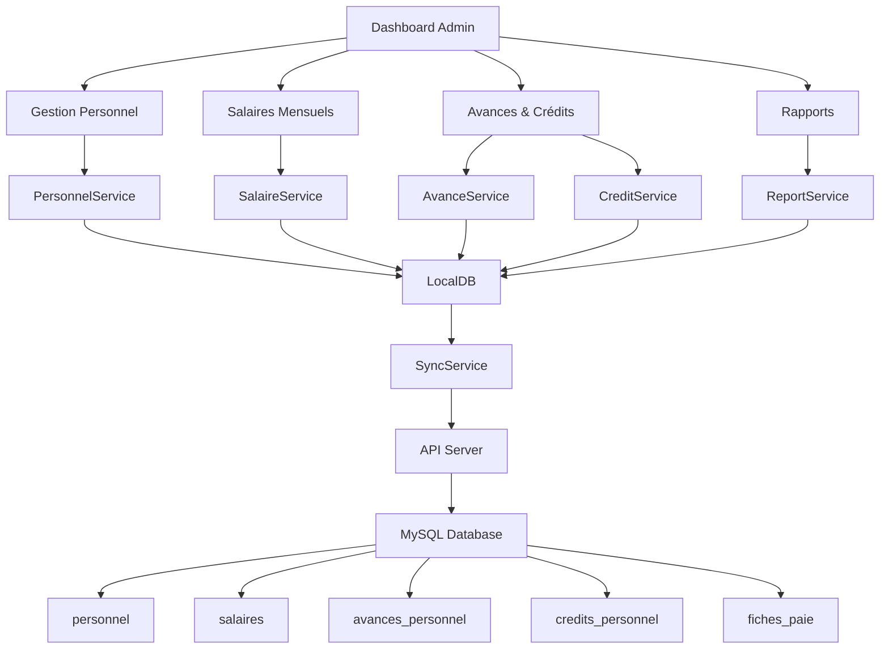
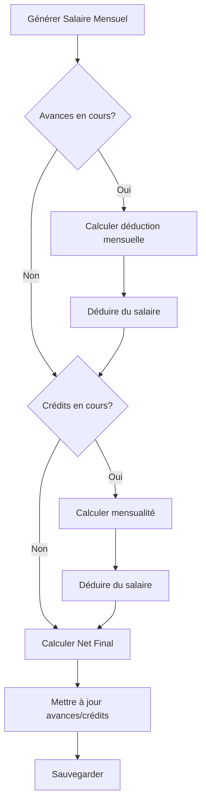
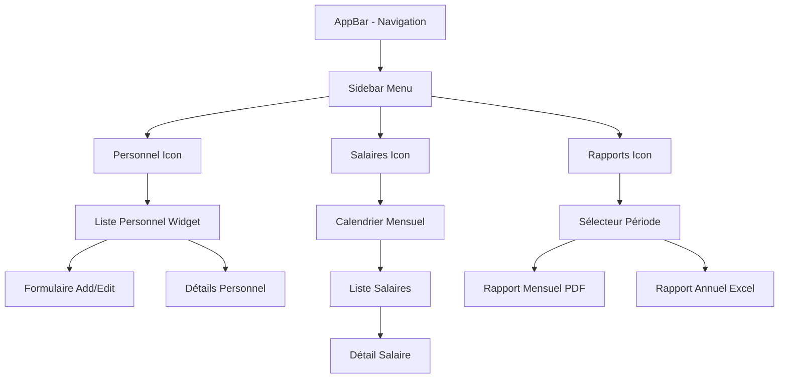
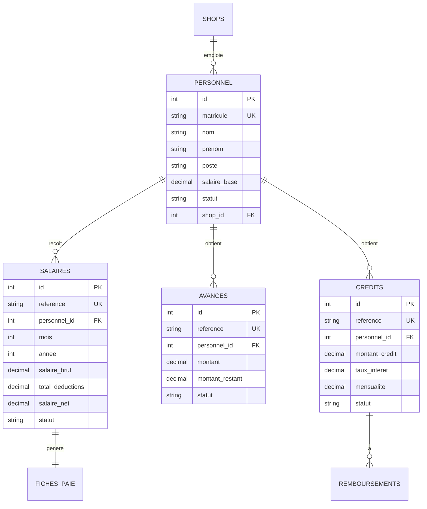
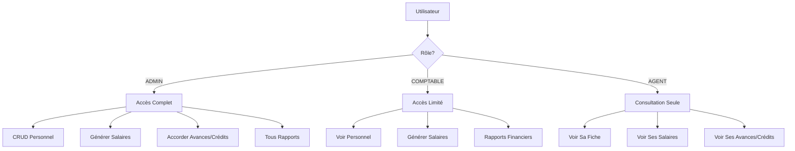
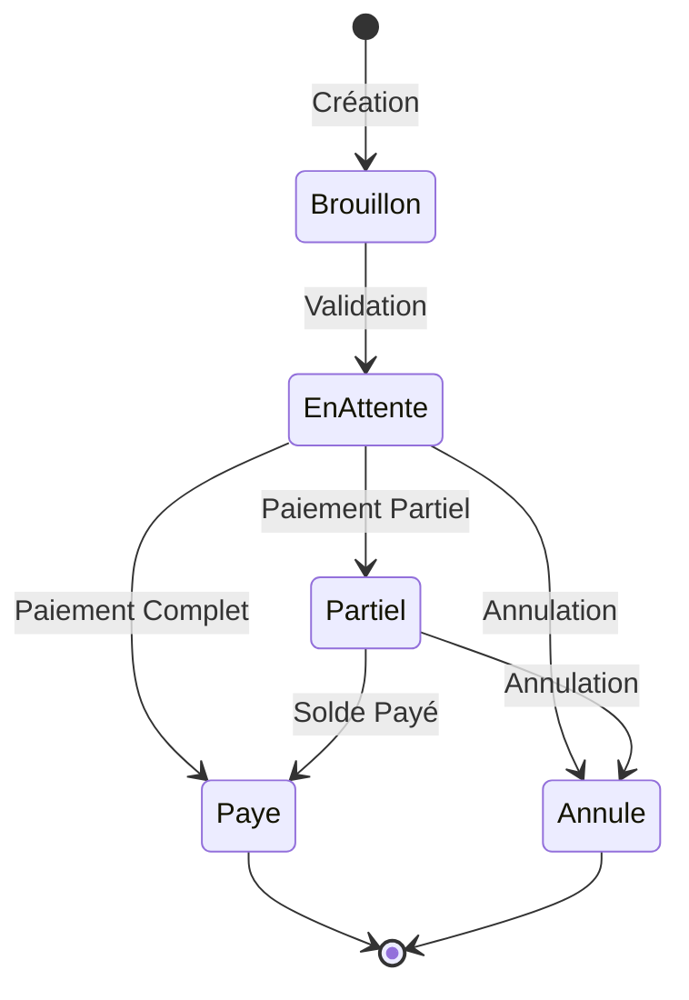
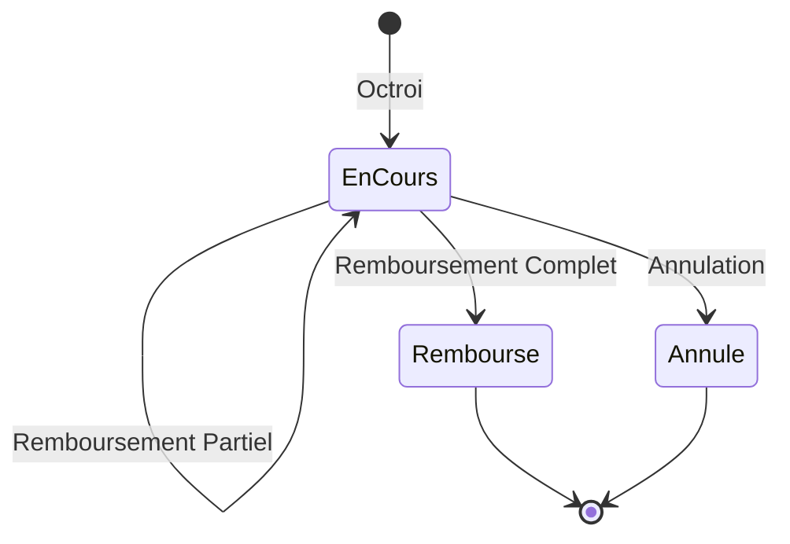

# 🏗️ Architecture du Système de Gestion du Personnel

## 📊 Diagramme de Structure



## 🔄 Flux de Données - Génération Salaire


## 💰 Flux de Remboursement



## 📱 Architecture UI



## 🗃️ Structure de la Base de Données



## 🔐 Gestion des Permissions



## 📊 Modèle de Données - Relations

```
Personnel (1) ──────────────► (N) Salaires
    │                              │
    │                              │
    │                              ▼
    │                         Fiches de Paie (1:1)
    │
    ├─────────────► (N) Avances
    │                    │
    │                    └─► Déductions Mensuelles
    │
    └─────────────► (N) Crédits
                         │
                         └─► (N) Remboursements
```

## 🔄 Cycle de Vie d'un Salaire



## 🔄 Cycle de Vie d'une Avance



## 📁 Structure des Fichiers du Projet

```
UCASHV01/
│
├── database/
│   └── create_personnel_management_tables.sql    ✅ Créé
│
├── lib/
│   ├── models/
│   │   ├── personnel_model.dart                  ✅ Créé
│   │   ├── salaire_model.dart                    ✅ Créé
│   │   ├── avance_personnel_model.dart           ✅ Créé
│   │   ├── credit_personnel_model.dart           ✅ Créé
│   │   └── fiche_paie_model.dart                 ✅ Créé
│   │
│   ├── services/
│   │   ├── personnel_service.dart                ⏳ À créer
│   │   ├── salaire_service.dart                  ⏳ À créer
│   │   ├── avance_service.dart                   ⏳ À créer
│   │   ├── credit_service.dart                   ⏳ À créer
│   │   └── fiche_paie_service.dart               ⏳ À créer
│   │
│   └── widgets/
│       ├── gestion_personnel_widget.dart         ⏳ À créer
│       ├── salaires_mensuels_widget.dart         ⏳ À créer
│       ├── avances_credits_widget.dart           ⏳ À créer
│       └── rapport_paiements_widget.dart         ⏳ À créer
│
├── server/
│   └── api/sync/
│       ├── personnel/                            ⏳ À créer
│       │   ├── upload.php
│       │   └── changes.php
│       ├── salaires/                             ⏳ À créer
│       ├── avances/                              ⏳ À créer
│       └── credits/                              ⏳ À créer
│
└── Documentation/
    ├── GESTION_PERSONNEL_GUIDE.md                ✅ Créé
    ├── PERSONNEL_MANAGEMENT_SUMMARY.md           ✅ Créé
    └── PERSONNEL_ARCHITECTURE.md                 ✅ Créé
```

## 🎯 Points d'Entrée de l'Application

### 1. Dashboard Admin

```dart
// Dans dashboard_admin.dart

ListTile(
  leading: Icon(Icons.people, color: Colors.blue),
  title: Text('Gestion du Personnel'),
  onTap: () {
    Navigator.push(
      context,
      MaterialPageRoute(
        builder: (context) => GestionPersonnelWidget(),
      ),
    );
  },
),
```

### 2. Menu Salaires

```dart
ListTile(
  leading: Icon(Icons.attach_money, color: Colors.green),
  title: Text('Salaires Mensuels'),
  onTap: () {
    Navigator.push(
      context,
      MaterialPageRoute(
        builder: (context) => SalairesMensuelsWidget(),
      ),
    );
  },
),
```

### 3. Menu Rapports

```dart
ListTile(
  leading: Icon(Icons.assessment, color: Colors.orange),
  title: Text('Rapports Personnel'),
  onTap: () {
    Navigator.push(
      context,
      MaterialPageRoute(
        builder: (context) => RapportPaiementsWidget(),
      ),
    );
  },
),
```

## 🔧 Technologies Utilisées

| Composant | Technologie |
|-----------|-------------|
| Frontend | Flutter/Dart |
| Backend | PHP 7.4+ |
| Base de données | MySQL 8.0 |
| PDF Generation | pdf package (Dart) |
| Synchronisation | REST API |
| Stockage local | sqflite (LocalDB) |
| UI Framework | Material Design |

## 📈 Performance & Optimisation

### Index Créés

```sql
-- Personnel
CREATE INDEX idx_personnel_actif ON personnel(statut, shop_id);
CREATE INDEX idx_matricule ON personnel(matricule);

-- Salaires
CREATE INDEX idx_salaires_periode_statut ON salaires(annee, mois, statut);
CREATE INDEX idx_personnel_id ON salaires(personnel_id);

-- Avances
CREATE INDEX idx_avances_statut_personnel ON avances_personnel(statut, personnel_id);

-- Crédits
CREATE INDEX idx_credits_statut_personnel ON credits_personnel(statut, personnel_id);
```

### Triggers pour Performance

- Calcul automatique du salaire brut/net (évite calculs client-side)
- Mise à jour auto des montants restants
- Détection auto des retards de crédit

## 🔒 Sécurité

### Validation des Données

- ✅ Matricule unique obligatoire
- ✅ Salaire base > 0
- ✅ Dates cohérentes (embauche < fin contrat)
- ✅ Montants > 0 pour avances/crédits
- ✅ Taux intérêt >= 0

### Contraintes BD

- ✅ Foreign Keys (CASCADE/SET NULL)
- ✅ Unique Keys (matricule, référence)
- ✅ NOT NULL sur champs critiques
- ✅ DEFAULT values appropriées

## 🎨 Palette de Couleurs

```dart
// Statuts Personnel
static const Color actif = Color(0xFF4CAF50);      // Vert
static const Color suspendu = Color(0xFFFF9800);   // Orange
static const Color demissionne = Color(0xFF9E9E9E); // Gris

// Statuts Paiement
static const Color enAttente = Color(0xFFFF9800);  // Orange
static const Color paye = Color(0xFF2196F3);       // Bleu
static const Color partiel = Color(0xFFFFC107);    // Jaune
static const Color annule = Color(0xFFF44336);     // Rouge

// Statuts Crédit
static const Color enCours = Color(0xFF2196F3);    // Bleu
static const Color rembourse = Color(0xFF4CAF50);  // Vert
static const Color enRetard = Color(0xFFF44336);   // Rouge
```

## 📊 Métriques & KPIs

### Indicateurs Principaux

1. **Masse Salariale Mensuelle**: Total des salaires nets
2. **Taux de Paiement**: % de salaires payés à temps
3. **Avances en Cours**: Total des avances non remboursées
4. **Crédits en Retard**: Nombre et montant des crédits en retard
5. **Turnover**: Taux de rotation du personnel

### Rapports Générés

1. Rapport mensuel des paiements
2. Rapport annuel de la masse salariale
3. Rapport individuel par employé
4. Rapport des avances et crédits
5. Rapport de trésorerie RH

---

**Architecture créée le**: 17 Décembre 2024  
**Version**: 1.0  
**Projet**: UCASH V01 - Gestion du Personnel
