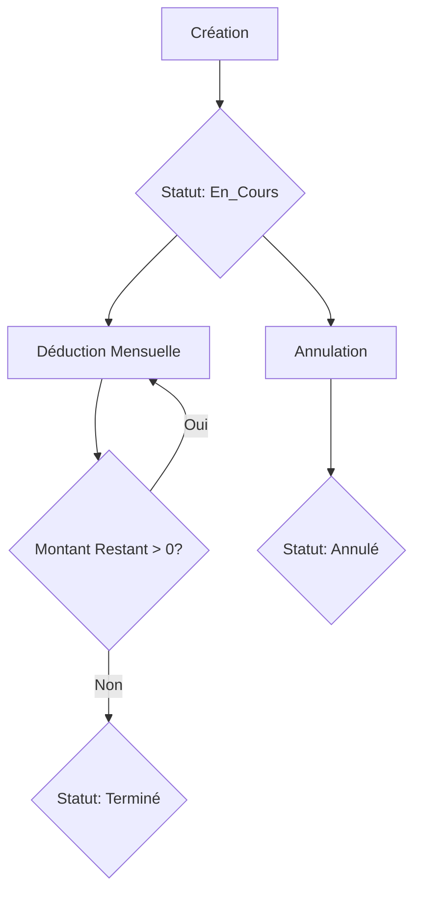

# 💰 Guide des Retenues sur Salaire - Personnel UCASH V01

## 📋 Vue d'Ensemble

Le système de **Retenues sur Salaire** permet de déduire automatiquement des montants des salaires des agents sur plusieurs mois. Ceci est utile pour gérer:

- 🔴 **Pertes** supportées par un agent (ex: manque caisse, perte stock)
- 💳 **Dettes** de l'agent envers l'entreprise
- ⚠️ **Sanctions** financières disciplinaires
- 📝 **Autres** retenues personnalisées

---

## 🎯 Fonctionnalités Principales

### ✅ Caractéristiques

- **Répartition sur plusieurs mois** - Déduction automatique mensuelle
- **Calcul automatique** - Montant mensuel calculé automatiquement
- **Suivi en temps réel** - Montant déjà déduit et montant restant
- **Statuts automatiques** - Passage automatique à "Terminé" quand complètement payé
- **Flexible** - Peut être annulée ou modifiée si nécessaire
- **Intégration salaire** - Déduite automatiquement lors du calcul du salaire

---

## 📊 Structure d'une Retenue

### Informations de Base

| Champ | Type | Description |
|-------|------|-------------|
| **Référence** | String | Ex: RET20241217153045 (Auto-généré) |
| **Agent** | Personnel | L'agent concerné |
| **Montant Total** | Décimal | Montant total à retenir |
| **Nombre de Mois** | Entier | Sur combien de mois répartir |
| **Mois/Année Début** | Date | Quand commencer les déductions |

### Classification

| Champ | Valeurs | Description |
|-------|---------|-------------|
| **Type** | Perte, Dette, Sanction, Autre | Nature de la retenue |
| **Statut** | En_Cours, Terminé, Annulé | État actuel |
| **Motif** | Texte | Raison détaillée |

### Suivi

| Champ | Calculé | Description |
|-------|---------|-------------|
| **Montant Mensuel** | Auto | Montant total ÷ Nombre de mois |
| **Montant Déjà Déduit** | Auto | Somme des déductions effectuées |
| **Montant Restant** | Auto | Montant total - Déjà déduit |

---

## 🔧 Utilisation

### 1. Créer une Retenue

```dart
final retenue = RetenuePersonnelModel(
  reference: RetenuePersonnelModel.generateReference(),
  personnelId: 1,
  montantTotal: 600.00,  // 600 USD à retenir
  nombreMois: 6,          // Sur 6 mois
  moisDebut: 1,          // Janvier
  anneeDebut: 2025,
  motif: 'Perte caisse - Manque 600 USD du 15/12/2024',
  type: 'Perte',
  creePar: 'Admin',
  notes: 'Accord avec l\'agent pour déduction sur 6 mois',
);

await RetenueService.instance.createRetenue(retenue);
```

**Résultat:**
- Déduction automatique de **100 USD/mois** de Janvier à Juin 2025

### 2. Vérifier les Retenues Actives

```dart
// Obtenir toutes les retenues d'un agent
final retenues = RetenueService.instance.getRetenuesParPersonnel(personnelId);

// Retenues actives pour un mois spécifique
final retenuesActives = RetenueService.instance.getRetenuesActivesParPeriode(
  personnelId: 1,
  mois: 1,
  annee: 2025,
);
```

### 3. Calculer le Total des Retenues

```dart
// Total des retenues à déduire pour Janvier 2025
final totalRetenues = RetenueService.instance.calculerTotalRetenuesPourPeriode(
  personnelId: 1,
  mois: 1,
  annee: 2025,
);
// Retourne: 100.00 (si une seule retenue de 600 USD sur 6 mois)
```

### 4. Intégration dans le Calcul du Salaire

Le calcul est automatique lors de la génération du salaire:

```dart
// Lors du calcul du salaire
final totalRetenues = RetenueService.instance.calculerTotalRetenuesPourPeriode(
  personnelId: personnel.id!,
  mois: selectedMonth,
  annee: selectedYear,
);

final salaire = SalaireModel(
  // ... autres champs
  autresDeductions: totalRetenues,  // Les retenues sont ajoutées ici
);

// Après le paiement, enregistrer les déductions
for (final retenue in retenuesActives) {
  final montantDeduit = retenue.getMontantPourPeriode(selectedMonth, selectedYear);
  await RetenueService.instance.enregistrerDeduction(
    retenueId: retenue.id!,
    montantDeduit: montantDeduit,
  );
}
```

---

## 📈 Exemples d'Utilisation

### Exemple 1: Perte de Caisse

**Situation:** Un agent a un manque de 900 USD dans sa caisse

```dart
final retenue = RetenuePersonnelModel(
  reference: RetenuePersonnelModel.generateReference(),
  personnelId: agentId,
  montantTotal: 900.00,
  nombreMois: 9,  // Répartir sur 9 mois
  moisDebut: DateTime.now().month,
  anneeDebut: DateTime.now().year,
  motif: 'Manque caisse - Audit du ${DateFormat('dd/MM/yyyy').format(DateTime.now())}',
  type: 'Perte',
  creePar: 'Admin',
  notes: 'Agent accepte la déduction de 100 USD/mois sur 9 mois',
);
```

**Impact:**
- **Déduction mensuelle:** 100 USD
- **Durée:** 9 mois
- **Total récupéré:** 900 USD

### Exemple 2: Sanction Disciplinaire

**Situation:** Sanction de 200 USD pour manquement grave

```dart
final retenue = RetenuePersonnelModel(
  reference: RetenuePersonnelModel.generateReference(),
  personnelId: agentId,
  montantTotal: 200.00,
  nombreMois: 2,  // Sur 2 mois
  moisDebut: DateTime.now().month + 1,  // Mois prochain
  anneeDebut: DateTime.now().year,
  motif: 'Sanction disciplinaire - Rapport du ${DateFormat('dd/MM/yyyy').format(DateTime.now())}',
  type: 'Sanction',
  creePar: 'RH Manager',
  notes: 'Suite à l\'incident du 15/12/2024',
);
```

**Impact:**
- **Déduction mensuelle:** 100 USD
- **Durée:** 2 mois
- **Total récupéré:** 200 USD

### Exemple 3: Dette Personnelle

**Situation:** Agent a emprunté 1500 USD à l'entreprise

```dart
final retenue = RetenuePersonnelModel(
  reference: RetenuePersonnelModel.generateReference(),
  personnelId: agentId,
  montantTotal: 1500.00,
  nombreMois: 12,  // Sur 1 an
  moisDebut: 1,
  anneeDebut: 2025,
  motif: 'Prêt personnel accordé le ${DateFormat('dd/MM/yyyy').format(DateTime.now())}',
  type: 'Dette',
  creePar: 'Finance Manager',
  notes: 'Remboursement sur 12 mois sans intérêt',
);
```

**Impact:**
- **Déduction mensuelle:** 125 USD
- **Durée:** 12 mois
- **Total récupéré:** 1500 USD

---

## 🔄 Cycle de Vie d'une Retenue



### États

1. **En_Cours** ✅
   - Retenue active
   - Déductions mensuelles en cours
   - Montant restant > 0

2. **Terminé** ✔️
   - Montant complètement récupéré
   - Plus de déductions
   - Passage automatique

3. **Annulé** ❌
   - Retenue annulée manuellement
   - Déductions arrêtées
   - Montant restant non récupéré

---

## 💡 Bonnes Pratiques

### ✅ À Faire

1. **Documentation claire**
   - Toujours préciser le motif détaillé
   - Ajouter des notes avec le contexte
   - Référencer les documents justificatifs

2. **Accord de l'agent**
   - Obtenir l'accord écrit de l'agent
   - Mentionner cet accord dans les notes
   - Archiver la preuve

3. **Montants raisonnables**
   - Ne pas dépasser 30% du salaire net mensuel
   - Répartir sur suffisamment de mois
   - Éviter de mettre l'agent en difficulté

4. **Suivi régulier**
   - Vérifier les déductions chaque mois
   - Informer l'agent du solde restant
   - Documenter chaque déduction

### ❌ À Éviter

1. **Retenues excessives**
   - Trop de déductions simultanées
   - Montants mensuels trop élevés
   - Période trop courte

2. **Manque de documentation**
   - Pas de motif clair
   - Pas d'accord de l'agent
   - Pas de suivi

3. **Modifications arbitraires**
   - Changer les conditions sans raison
   - Annuler sans justification
   - Modifier les montants

---

## 📊 Rapports et Suivi

### Vue d'Ensemble des Retenues

```dart
// Toutes les retenues en cours
final enCours = RetenueService.instance.retenues
  .where((r) => r.statut == 'En_Cours')
  .toList();

// Total à récupérer
final totalRestant = enCours.fold<double>(
  0.0, 
  (sum, r) => sum + r.montantRestant
);
```

### Retenues par Agent

```dart
// Retenues d'un agent spécifique
final retenuesAgent = RetenueService.instance.getRetenuesParPersonnel(agentId);

// Impact mensuel actuel
final impactMensuel = RetenueService.instance.calculerTotalRetenuesPourPeriode(
  personnelId: agentId,
  mois: DateTime.now().month,
  annee: DateTime.now().year,
);
```

---

## 🔐 Sécurité et Permissions

### Qui Peut Créer des Retenues?

- ✅ **Admin** - Toutes les retenues
- ✅ **RH Manager** - Retenues disciplinaires
- ✅ **Finance Manager** - Dettes et pertes
- ❌ **Agents** - Ne peuvent pas créer de retenues

### Qui Peut Annuler?

- ✅ **Admin** - Peut tout annuler
- ✅ **Créateur** - Peut annuler sa propre retenue (dans les 24h)
- ❌ **Autres** - Pas d'annulation

---

## 🗃️ Base de Données

### Table: `retenues_personnel`

```sql
CREATE TABLE retenues_personnel (
    id INT AUTO_INCREMENT PRIMARY KEY,
    reference VARCHAR(50) UNIQUE,
    personnel_id INT,
    montant_total DECIMAL(15,2),
    montant_deduit_mensuel DECIMAL(15,2),
    nombre_mois INT,
    mois_debut INT,
    annee_debut INT,
    motif VARCHAR(255),
    type ENUM('Perte', 'Dette', 'Sanction', 'Autre'),
    statut ENUM('En_Cours', 'Termine', 'Annule'),
    montant_deja_deduit DECIMAL(15,2),
    montant_restant DECIMAL(15,2),
    -- ... autres champs
);
```

### Triggers Automatiques

1. **before_insert_retenue** - Calcule montant_deduit_mensuel et montant_restant
2. **before_update_retenue** - Recalcule montant_restant et change statut si terminé

---

## ✅ Checklist d'Implémentation

### Phase 1: Modèles et Services ✅
- [x] Créer `RetenuePersonnelModel`
- [x] Créer `RetenueService`
- [x] Créer table SQL `retenues_personnel`
- [x] Ajouter triggers automatiques

### Phase 2: Intégration (À faire)
- [ ] Charger les retenues au démarrage
- [ ] Intégrer dans le calcul du salaire
- [ ] Enregistrer les déductions après paiement
- [ ] Afficher les retenues dans la fiche agent

### Phase 3: Interface UI (À faire)
- [ ] Page de gestion des retenues
- [ ] Formulaire de création
- [ ] Liste des retenues par agent
- [ ] Suivi visuel du remboursement

---

## 🎯 Résumé

Le système de **Retenues sur Salaire** offre:

- ✅ **Gestion automatisée** des déductions mensuelles
- ✅ **Suivi précis** des montants déduits et restants
- ✅ **Flexibilité** dans la répartition et les types
- ✅ **Intégration** transparente avec le calcul des salaires
- ✅ **Documentation** complète de chaque retenue
- ✅ **Sécurité** avec statuts et permissions

**Date de création:** 17 Décembre 2024  
**Version:** 1.0.0  
**Auteur:** UCASH V01 Development Team  
**Statut:** ✅ Ready for Integration
